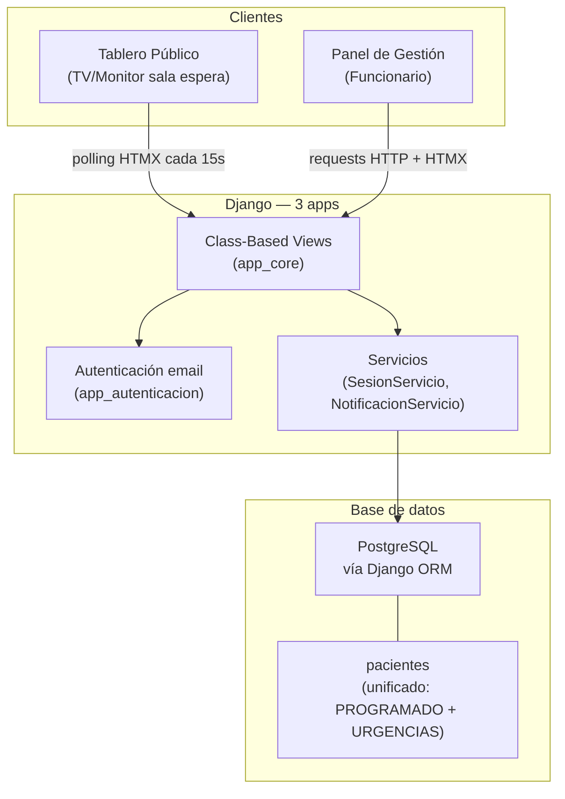

# Documento de Diseño Técnico
## Sistema de Seguimiento de Pacientes Quirúrgicos — MVP

---

## Visión General

Aplicación web en tiempo casi real que permite a los familiares de pacientes quirúrgicos conocer el estado del proceso sin interactuar con el personal médico. Funciona como un tablero tipo aeropuerto proyectado en sala de espera, con actualizaciones automáticas vía polling HTMX.

**Stack tecnológico (MVP):**
- Backend: Python + Django, vistas basadas en clases (CBV)
- Frontend: Django Templates + HTMX + Tailwind CSS (CDN) + Alpine.js (CDN, solo para UI ligera)
- Tiempo real: Polling con HTMX `hx-trigger="every 15s"`
- Base de datos: PostgreSQL
- Notificaciones: `logging` estándar de Python (print/log)
- Autenticación: email con validación de formato + whitelist/dominio configurable

**Fuera del MVP:**
- WebSockets / Django Channels
- Celery / tareas asíncronas
- DRF / API REST
- Twilio / SMS / WhatsApp
- Verificación real de email (OTP / magic link) — se implementa en v2
- Roles diferenciados (Administrador / Funcionario)
- Bloqueo de cuenta por intentos fallidos
- Sincronización en tiempo real con base de datos hospitalaria
- Property-Based Testing con Hypothesis

---

## Arquitectura



**Decisiones clave:**

- HTMX polling cada 15s cumple el requisito de actualización en ≤30s sin infraestructura adicional.
- Notificaciones v1: solo `logging.info()` / `logging.error()`. Sin Twilio ni servicios externos.
- Autenticación v1: validación de formato de email + whitelist/dominio configurable en settings.
- Un único rol implícito (staff). Sin diferenciación Administrador/Funcionario.
- Modelo `Paciente` unificado con campo `origen` (PROGRAMADO/URGENCIAS). Sin entidades separadas.
- Unicidad de sesión activa por paciente garantizada con `UniqueConstraint` a nivel de base de datos.
- FINALIZADO marca `oculto=True`; no elimina registros físicos.

---

## Estructura del proyecto

```
quiroinfo/                  # proyecto Django
├── app_autenticacion/      # login por email, logout
├── app_core/               # Paciente, Sesion, RegistroEstado, servicios, tablero, gestión
└── app_notificaciones/     # NotificacionServicio (print/log)
```

---

## Vistas y URLs

| Método | URL | Auth | Descripción |
|--------|-----|------|-------------|
| GET | `/` | No | Redirige a `/tablero/` |
| GET | `/tablero/` | No | Tablero público (template completo) |
| GET | `/tablero/fragmento/` | No | Fragmento HTMX: lista de sesiones visibles |
| GET | `/login/` | No | Formulario de login por email |
| POST | `/login/` | No | Valida formato y whitelist/dominio de email, crea sesión |
| POST | `/logout/` | Sí | Cierra sesión |
| GET | `/gestion/` | Sí | Panel de gestión (dos tablas paralelas) |
| POST | `/gestion/pacientes/agregar/` | Sí | Agrega Paciente con origen=URGENCIAS |
| POST | `/gestion/sesiones/estado/` | Sí | Crea o actualiza Sesion con el estado seleccionado |

---

## Modelos de Datos

### Enumeraciones

```python
# app_core/models.py
from django.db import models

class EstadoQuirurgico (models.TextChoices):
    EN_PREPARACION  = 'EN_PREPARACION',  'En preparación'
    EN_CIRUGIA      = 'EN_CIRUGIA',      'En cirugía'
    EN_RECUPERACION = 'EN_RECUPERACION', 'En recuperación'
    FINALIZADO      = 'FINALIZADO',      'Finalizado'
    OTRO            = 'OTRO',            'Otro'
```

### `Paciente` (app `app_core`)

Modelo unificado para todos los pacientes. El campo `origen` distingue entre programados y urgencias. Nunca expuesto directamente al Tablero.

```python
from django.db import models

class Paciente (models.Model):
    identificacion = models.CharField (max_length=50, unique=True)
    nombre         = models.CharField (max_length=255, null=True, blank=True)
    origen         = models.CharField (
                         max_length=20,
                         choices=[('PROGRAMADO', 'Programado'), ('URGENCIAS', 'Urgencias')]
                     )

    class Meta:
        db_table = 'pacientes'
```

### `Sesion` (app `app_core`)

Registro activo de un paciente en el tablero. La visibilidad se controla con `oculto`. La unicidad de sesión activa por paciente se garantiza con un `UniqueConstraint` a nivel de base de datos.

```python
import uuid
from django.db import models

class Sesion (models.Model):
    id              = models.UUIDField (primary_key=True, default=uuid.uuid4, editable=False)
    paciente        = models.ForeignKey (Paciente, on_delete=models.PROTECT)
    estado          = models.CharField (max_length=20, choices=EstadoQuirurgico.choices)
    descripcionOtro = models.CharField (max_length=50, null=True, blank=True)
    ingresadoEn     = models.DateTimeField (auto_now_add=True)
    actualizadoEn   = models.DateTimeField (auto_now=True)
    oculto          = models.BooleanField (default=False)

    class Meta:
        db_table = 'sesiones'
        constraints = [
            models.UniqueConstraint (
                fields=['paciente'],
                condition=models.Q (oculto=False),
                name='unique_active_session_per_patient'
            )
        ]
        indexes = [
            models.Index (fields=['oculto', 'ingresadoEn'])
        ]
```

### `RegistroEstado` (app `app_core`) *(opcional — auditoría mínima)*

Auditoría mínima de cambios de estado. Puede omitirse en MVP si se prioriza velocidad de entrega.

```python
class RegistroEstado (models.Model):
    id             = models.UUIDField (primary_key=True, default=uuid.uuid4, editable=False)
    sesion         = models.ForeignKey (Sesion, on_delete=models.PROTECT)
    estadoAnterior = models.CharField (max_length=20, null=True, blank=True)
    estadoNuevo    = models.CharField (max_length=20)
    cambiadoEn     = models.DateTimeField (auto_now_add=True)

    class Meta:
        db_table = 'registro_estados'
```

---

## Lógica de negocio

### `SesionServicio` (`app_core/servicios.py`)

```python
import logging
from django.core.exceptions import ValidationError
from .models import Paciente, Sesion, RegistroEstado, EstadoQuirurgico

logger = logging.getLogger (__name__)

class SesionServicio:

    def aplicarEstado (self, paciente: Paciente, nuevoEstado: str, descripcionOtro: str = None) -> Sesion:
        """Crea la sesión si no existe, o actualiza el estado si ya existe."""
        if nuevoEstado == EstadoQuirurgico.OTRO:
            if not descripcionOtro:
                raise ValidationError ("Descripción requerida para estado OTRO")
            descripcionOtro = descripcionOtro [:50].strip ()
        else:
            descripcionOtro = None

        sesion, creada = Sesion.objects.get_or_create (
            paciente=paciente,
            oculto=False,
            defaults={'estado': nuevoEstado, 'descripcionOtro': descripcionOtro}
        )
        estadoAnterior = None if creada else sesion.estado

        if nuevoEstado == EstadoQuirurgico.FINALIZADO:
            sesion.oculto = True
        else:
            sesion.estado = nuevoEstado
            sesion.descripcionOtro = descripcionOtro

        sesion.save ()
        RegistroEstado.objects.create (
            sesion=sesion,
            estadoAnterior=estadoAnterior,
            estadoNuevo=nuevoEstado,
        )
        logger.info (f"Estado aplicado: {paciente.identificacion} → {nuevoEstado}")
        return sesion
```

### Sesiones visibles en el Tablero

```python
# app_core/servicios.py

def obtenerSesionesVisibles ():
    """Retorna sesiones activas no ocultas, ordenadas por ingresadoEn descendente (más reciente primero)."""
    return (
        Sesion.objects
        .filter (oculto=False)
        .select_related ('paciente')
        .only ('id', 'paciente__identificacion', 'estado', 'descripcionOtro', 'ingresadoEn', 'actualizadoEn')
        .order_by ('-ingresadoEn')
    )
```

### `NotificacionServicio` (`app_notificaciones/servicios.py`)

```python
import logging

logger = logging.getLogger (__name__)

class NotificacionServicio:

    def notificarCambioEstado (self, identificacion: str, nuevoEstado: str) -> None:
        """Registra el cambio de estado en el log. Sin envío externo en v1."""
        logger.info (f"[NOTIFICACION] Paciente {identificacion}: nuevo estado → {nuevoEstado}")
```

---

## Autenticación Simplificada (`app_autenticacion`)

En v1 se valida el formato del email y se verifica contra una whitelist o dominio permitido configurado en `settings.py`. No se envía código ni OTP.

```python
# app_autenticacion/vistas.py
import re
from django.conf import settings
from django.shortcuts import render, redirect
from django.views import View

PATRON_EMAIL = re.compile (r'^[^@\s]+@[^@\s]+\.[^@\s]+$')

class LoginVista (View):

    def get (self, request):
        return render (request, 'autenticacion/login.html')

    def post (self, request):
        email = request.POST.get ('email', '').strip ()
        if not PATRON_EMAIL.match (email):
            return render (request, 'autenticacion/login.html', {'error': 'Correo electrónico no válido.'})
        if not self._emailAutorizado (email):
            return render (request, 'autenticacion/login.html', {'error': 'Correo electrónico no autorizado.'})
        request.session ['email'] = email
        return redirect ('gestion')

    def _emailAutorizado (self, email: str) -> bool:
        """Verifica whitelist o dominio permitido desde settings."""
        whitelist = getattr (settings, 'EMAIL_WHITELIST', [])
        dominio   = getattr (settings, 'EMAIL_DOMINIO_PERMITIDO', None)
        if whitelist:
            return email in whitelist
        if dominio:
            return email.endswith (f'@{dominio}')
        return False
```

La protección de vistas privadas se implementa con un mixin simple que verifica `request.session['email']`:

```python
# app_autenticacion/mixins.py
from django.shortcuts import redirect

class LoginRequeridoMixin:
    def dispatch (self, request, *args, **kwargs):
        if not request.session.get ('email'):
            return redirect ('login')
        return super ().dispatch (request, *args, **kwargs)
```

---

## Colores de Estado

```python
# app_core/servicios.py
coloresEstado = {
    EstadoQuirurgico.EN_PREPARACION:  'bg-yellow-400',
    EstadoQuirurgico.EN_CIRUGIA:      'bg-orange-500',
    EstadoQuirurgico.EN_RECUPERACION: 'bg-blue-500',
    EstadoQuirurgico.FINALIZADO:      'bg-gray-400',
    EstadoQuirurgico.OTRO:            'bg-purple-500',
}
```

---

## Tablero Público (`/tablero/`)

- Sin autenticación
- Template completo con layout para TV/monitor (texto mínimo 48px)
- Tailwind CSS: colores de estado, tipografía grande, layout de pantalla completa
- HTMX polling: `hx-get="/tablero/fragmento/"`, `hx-trigger="every 15s"`, `hx-swap="innerHTML"`
- Muestra: `identificacion`, `estado` con color, `descripcionOtro` (si estado es OTRO), `ingresadoEn`
- Orden: por `ingresadoEn` descendente (más reciente primero)
- Si no hay sesiones activas: mensaje simple "No hay pacientes en seguimiento"
- Sin interacción de usuario

---

## Panel de Gestión (`/gestion/`)

- Requiere autenticación (`LoginRequeridoMixin`)
- Layout con dos tablas paralelas (lado a lado, `flex` o `grid` Tailwind)

### Tabla Izquierda — Pacientes

Columnas: IDENTIFICACION | NOMBRE | ESTADO

La columna ESTADO contiene cinco radio buttons visuales (uno por cada `EstadoQuirurgico`). Solo uno puede estar activo a la vez; el botón activo se destaca con color. Al presionar un botón:

- Si el paciente NO está en sala → se crea una `Sesion` con ese estado (HTMX POST a `/gestion/sesiones/estado/`).
- Si el paciente YA está en sala → se actualiza su estado (mismo endpoint).
- Si se selecciona FINALIZADO → la sesión se marca `oculto=True` y el paciente desaparece de la Tabla_En_Sala.
- Si se selecciona OTRO → aparece un campo de texto inline (Alpine.js) para ingresar la descripción (máx. 50 chars).

Debajo de la tabla: botón "Adicionar paciente" que abre un formulario inline para ingresar `identificacion` y `nombre` de un paciente de urgencias (origen=URGENCIAS).

### Tabla Derecha — Pacientes en Sala

Columnas: IDENTIFICACION | ESTADO | HORA INGRESO

Esta tabla refleja exactamente lo que se muestra en el Tablero público. Se actualiza vía HTMX al mismo tiempo que la Tabla_Programados.

---

## Manejo de Errores (MVP)

| Escenario | Comportamiento |
|-----------|---------------|
| Email con formato inválido en login | HTTP 200 con mensaje de error en el formulario |
| Email no autorizado en login | HTTP 200 con mensaje de error en el formulario |
| Fallo de persistencia al actualizar estado | HTTP 500; conserva estado anterior; notifica al Funcionario |
| Usuario no autenticado en `/gestion/` | Redirección 302 a `/login/` |
| Sesión inactiva > 120 minutos | Django expira la sesión; redirige a login |
| Error interno en cambio de estado | `logging.error()` registra el error; no interrumpe el flujo |
| Estado OTRO sin descripción | `ValidationError`; HTTP 400 con mensaje de error |

---

## Testing Mínimo

### Herramientas
- `pytest-django`
- `factory_boy`

### Tests de servicios críticos
- `SesionServicio.aplicarEstado()`: crea sesión si no existe, actualiza si ya existe
- `SesionServicio.aplicarEstado()` con FINALIZADO: marca `oculto=True`, conserva registro
- `SesionServicio.aplicarEstado()` con OTRO: guarda `descripcionOtro` truncado a 50 chars
- `SesionServicio.aplicarEstado()` con OTRO sin descripción: lanza `ValidationError`
- `SesionServicio.aplicarEstado()` con estado distinto a OTRO: `descripcionOtro` es None
- `obtenerSesionesVisibles()`: no retorna sesiones con `oculto=True`
- `obtenerSesionesVisibles()`: retorna sesiones ordenadas por `ingresadoEn` descendente

### Test básico de vista (opcional)
- `/tablero/` carga sin autenticación y no expone el campo `nombre` del paciente
- `/gestion/` redirige a `/login/` sin sesión activa
- Login con email de dominio no autorizado retorna error
