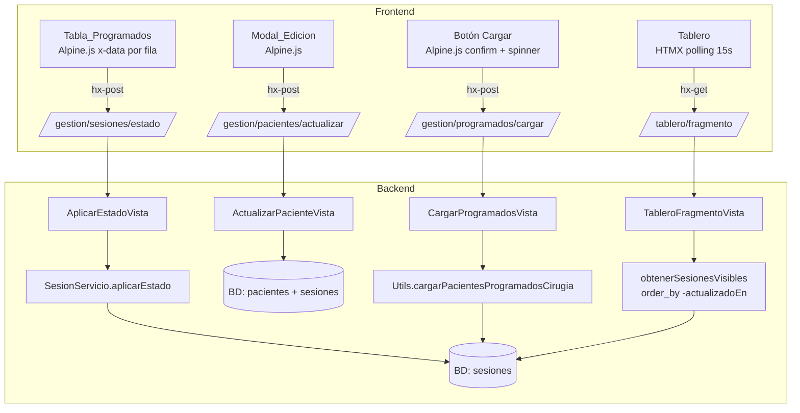

# Documento de Diseño — Mejoras MVP Quiroinfo

## Visión General

Este documento describe el diseño técnico para las mejoras al MVP de Quiroinfo:

1. Simplificación del Botón_OTRO (eliminación de `descripcionOtro`, persistencia de `labelOtro` en BD)
2. Modal de edición de pacientes en el Panel_Gestion (identificación + estado OTRO)
3. Tablero refactorizado como pantalla TV (flex layout, fuentes vh, hora 12h)
4. Estilo visual oscuro en la Tabla_Pacientes_En_Sala
5. Orden consistente entre tablas (derivado de `sesionesActivas`)
6. Eliminación del modelo `RegistroEstado`
7. Carga manual de pacientes programados (`CargarProgramadosVista`)
8. CASCADE delete en `Sesion.paciente`

La arquitectura permanece sin cambios: Django SSR + HTMX + Alpine.js + Tailwind CSS CDN.

---

## Arquitectura



### Cambios por capa

| Capa | Cambio |
|---|---|
| Modelo (`models.py`) | Eliminar `descripcionOtro`; agregar `labelOtro`; cambiar FK a `CASCADE`; eliminar `RegistroEstado` |
| Migraciones | 0002 elimina `descripcionOtro`; 0003 agrega `labelOtro`; 0005 elimina `RegistroEstado`; 0007 cambia FK a CASCADE |
| Servicio (`servicios.py`) | `aplicarEstado` acepta `labelOtro`; `obtenerSesionesVisibles` ordena por `-actualizadoEn` e incluye `labelOtro` en `.only()`; sin `RegistroEstado` |
| Vista (`vistas.py`) | Nuevas vistas `ActualizarPacienteVista` y `CargarProgramadosVista`; `_contextoGestion` deriva orden de `sesionesActivas` |
| Template `fragmento_tablas.html` | Botón_OTRO simplificado; Modal_Edicion; estilo oscuro en Tabla_En_Sala; botón Cargar |
| Template `tablero/fragmento.html` | Flex layout; fuentes `clamp(min, Xvh, max)`; hora en formato 12h |
| Template `tablero/tablero.html` | `html/body` con `height: 100vh; overflow: hidden` |
| `utils.py` | `cargarPacientesProgramadosCirugia` usa ORM (no SQL raw) |

---

## Componentes e Interfaces

### 1. Modelo `Sesion`

```python
class Sesion (models.Model):
    id            = models.UUIDField (primary_key=True, default=uuid.uuid4, editable=False)
    paciente      = models.ForeignKey (Paciente, on_delete=models.CASCADE)
    estado        = models.CharField (max_length=20, choices=EstadoQuirurgico.choices)
    labelOtro     = models.CharField (max_length=50, default='Otro')
    ingresadoEn   = models.DateTimeField (auto_now_add=True)
    actualizadoEn = models.DateTimeField (auto_now=True)
    oculto        = models.BooleanField (default=False)
```

Cambios respecto al modelo original:
- `descripcionOtro` eliminado (migración 0002)
- `labelOtro` agregado con `default='Otro'` (migración 0003)
- `paciente` cambiado de `PROTECT` a `CASCADE` (migración 0007)
- `RegistroEstado` eliminado completamente (migración 0005)

### 2. `SesionServicio.aplicarEstado`

```python
def aplicarEstado (self, paciente: Paciente, nuevoEstado: str, labelOtro: str = 'Otro') -> Sesion:
    """Crea la sesión si no existe, o actualiza el estado si ya existe."""
```

- Acepta `labelOtro` como parámetro opcional (default `'Otro'`).
- Persiste `labelOtro` en BD cuando `nuevoEstado == 'OTRO'`.
- No crea registros de auditoría (`RegistroEstado` eliminado).

### 3. `obtenerSesionesVisibles`

```python
def obtenerSesionesVisibles ():
    """Retorna sesiones activas no ocultas, ordenadas por actualizadoEn descendente."""
    return (
        Sesion.objects
        .filter (oculto=False)
        .select_related ('paciente')
        .only ('id', 'paciente__identificacion', 'estado', 'labelOtro', 'ingresadoEn', 'actualizadoEn')
        .order_by ('-actualizadoEn')
    )
```

### 4. `_contextoGestion`

```python
def _contextoGestion ():
    sesiones = list (obtenerSesionesVisibles ())
    sesionPorPaciente = {s.paciente_id: s for s in sesiones}
    pacientesConSesion = [s.paciente for s in sesiones]
    pacientesSinSesion = list (
        Paciente.objects.exclude (pk__in={p.pk for p in pacientesConSesion}).order_by ('identificacion')
    )
    pacientes = pacientesConSesion + pacientesSinSesion
    ...
```

Garantiza que Tabla_Programados y Tabla_En_Sala usen el mismo orden (`-actualizadoEn`).

### 5. `ActualizarPacienteVista` — nuevo

`POST /gestion/pacientes/actualizar/`

Recibe: `pacienteId`, `nuevaIdentificacion`, `labelOtro` (opcional), `estadoOtro` (opcional).

Lógica:
1. Persiste `Paciente.identificacion`.
2. Si `estadoOtro` y `labelOtro` presentes: llama `SesionServicio.aplicarEstado(paciente, 'OTRO', labelOtro=labelOtro)`.
3. Retorna `fragmento_tablas.html` via HTMX.

### 6. `CargarProgramadosVista` — nuevo

`POST /gestion/programados/cargar/`

- Protegida con `LoginRequeridoMixin`.
- Lock de clase `_ejecutando` para prevenir concurrencia; retorna HTTP 409 si ya en progreso.
- Llama `Utils.cargarPacientesProgramadosCirugia()`.
- Retorna `fragmento_tablas.html` via HTMX.

### 7. `Utils.cargarPacientesProgramadosCirugia`

Usa Django ORM exclusivamente:

```python
Paciente.objects.all ().delete ()   # CASCADE elimina Sesiones asociadas
for datos in pacientes_data:
    Paciente.objects.create (**datos)
```

### 8. Modal_Edicion

Flujo al guardar:
1. Validar que `editId.trim()` no esté vacío.
2. Si `editEstado !== editEstadoOriginal`: incluir `labelOtro` y `estadoOtro` en el POST.
3. POST a `ActualizarPacienteVista` via `htmx.ajax`.
4. Cerrar modal.

`editEstadoOriginal` se inicializa al abrir el modal para detectar si el usuario realmente modificó el estado.

### 9. Tablero — layout TV

`tablero.html`:
- `html, body`: `height: 100vh; overflow: hidden; display: flex; flex-direction: column`

`fragmento.html`:
- `.tablero-lista`: `display: flex; flex-direction: column; height: 100%`
- Cada `.tablero-fila`: `flex: 1 1 0; min-height: 0` — divide la altura equitativamente
- Fuentes con `clamp(min, Xvh, max)`:
  - Identificación: `clamp(1rem, 4.5vh, 4rem)`
  - Badge estado: `clamp(0.85rem, 3.5vh, 3rem)`
  - Hora: `clamp(0.75rem, 2.5vh, 2rem)`
- Hora: `{{ sesion.actualizadoEn|date:"g:i a" }}` → "08:50 am"

---

## Modelos de Datos

### Sesion (estado final)

| Campo | Tipo | Notas |
|---|---|---|
| `id` | UUID PK | auto |
| `paciente` | FK Paciente | CASCADE |
| `estado` | CharField(20) | EstadoQuirurgico choices |
| `labelOtro` | CharField(50) | default='Otro'; persiste el label del Botón_OTRO |
| `ingresadoEn` | DateTimeField | auto_now_add |
| `actualizadoEn` | DateTimeField | auto_now |
| `oculto` | BooleanField | default=False |

`RegistroEstado` eliminado. `labelOtro` es fuente de verdad en BD — los templates lo leen directamente:

```html
{{ sesion.labelOtro }}{{ sesion.get_estado_display }}
```

---

## Endpoints

| Método | URL | Vista | Auth |
|---|---|---|---|
| GET | `/tablero/` | `TableroVista` | No |
| GET | `/tablero/fragmento/` | `TableroFragmentoVista` | No |
| GET | `/gestion/` | `GestionVista` | Sí |
| POST | `/gestion/sesiones/estado/` | `AplicarEstadoVista` | Sí |
| POST | `/gestion/pacientes/agregar/` | `AgregarPacienteVista` | Sí |
| POST | `/gestion/pacientes/actualizar/` | `ActualizarPacienteVista` | Sí |
| POST | `/gestion/programados/cargar/` | `CargarProgramadosVista` | Sí |

---

## Propiedades de Corrección

### Propiedad 1: Filtrado de sesiones visibles

`obtenerSesionesVisibles()` debe retornar exactamente y únicamente las sesiones con `oculto=False`.

**Valida: Requisito 3.1**

### Propiedad 2: Ordenamiento por actualizadoEn descendente

Para todo par consecutivo `s_i`, `s_{i+1}` en el resultado, se cumple `s_i.actualizadoEn >= s_{i+1}.actualizadoEn`.

**Valida: Requisitos 3.2, 4.1, 5.1**

---

## Manejo de Errores

- Modal: `editId` vacío → `errorEdicion` sin cerrar modal.
- `CargarProgramadosVista`: `_ejecutando == True` → HTTP 409.
- Tablero polling: `htmx:send-error` → banner "Sin conexión" via Alpine.js.

---

## Estrategia de Testing

Tests unitarios + Hypothesis (PBT) para las dos propiedades de corrección. Ver `app_core/test_servicios.py` y `app_core/test_vistas.py`.
