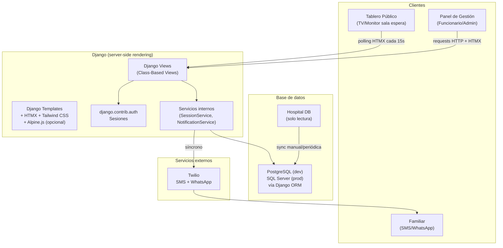

# Documento de Diseño Técnico
## Sistema de Seguimiento de Pacientes Quirúrgicos para Familiares

---

## Visión General

El sistema es una aplicación web en tiempo casi real que permite a los familiares de pacientes quirúrgicos conocer el estado del proceso sin interactuar con el personal médico. Funciona como un tablero tipo aeropuerto proyectado en sala de espera, con actualizaciones automáticas y notificaciones vía SMS/WhatsApp.

**Características clave del diseño:**
- Interfaz pública (Tablero) sin autenticación, solo lectura, optimizada para TV/monitor
- Interfaz privada (Panel de Gestión) con autenticación, dividida en panel operativo y previsualización del tablero
- Actualizaciones en tiempo casi real mediante polling periódico con HTMX (cada 15 segundos)
- Notificaciones automáticas a familiares vía SMS y WhatsApp al cambiar el estado (síncronas en MVP)
- Privacidad por diseño: el Tablero nunca expone datos personales
- Acceso a datos exclusivamente a través del ORM de Django — compatible con PostgreSQL y SQL Server

**Stack tecnológico (Fase 1 — MVP):**
- Frontend: Django Templates + HTMX + Tailwind CSS + Alpine.js (opcional)
- Backend: Python + Django (vistas estándar, sin DRF en fase inicial)
- Tiempo real: Polling periódico con HTMX `hx-trigger="every 15s"`
- Tareas asíncronas: Ejecución síncrona en MVP (sin Celery)
- Base de datos: PostgreSQL (desarrollo) / SQL Server (producción) — configurado en `settings.py`
- Notificaciones: Twilio SDK para Python (síncrono en MVP)
- Autenticación: `django.contrib.auth` con sesiones (`LoginView`/`LogoutView`)
- Transporte: HTTPS obligatorio

---

## Arquitectura Evolutiva por Fases

El diseño está estructurado para crecer sin reescritura. Cada fase agrega capacidades sobre la anterior.

```
Fase 1 (MVP)  → Django Templates + HTMX + Tailwind CSS + Alpine.js + polling + sesiones + tareas síncronas
Fase 2        → Agregar DRF para API REST; mantener templates como alternativa
Fase 3        → Agregar Django Channels + Redis para WebSockets; reemplazar polling
Fase 4        → Agregar Celery para tareas asíncronas; reemplazar ejecución síncrona
Fase 5 (opt.) → Frontend SPA con React consumiendo la API REST de Fase 2
```

### Fase 1 — MVP (diseño actual)

- Renderizado server-side con Django Templates
- Tailwind CSS para estilos utilitarios: colores de estado, layout del tablero, panel dividido. En desarrollo se carga via CDN (`<script src="https://cdn.tailwindcss.com">`); en producción se compila con `django-tailwind` o la CLI de `tailwindcss` para generar un bundle optimizado (purge de clases no usadas).
- HTMX para actualizaciones parciales sin recargar la página (`hx-get`, `hx-trigger="every 15s"`, `hx-swap`)
- Alpine.js (opcional) para comportamientos ligeros en el cliente: modales de confirmación, dropdowns, toggles. Se carga via CDN (`<script defer src="https://cdn.jsdelivr.net/npm/alpinejs@3.x.x/dist/cdn.min.js">`). No se requiere paso de build.
- Autenticación por sesiones con `django.contrib.auth`
- Notificaciones SMS/WhatsApp enviadas síncronamente en el mismo request al cambiar el estado
- Sin Redis, sin Celery, sin WebSockets, sin DRF

### Fase 2 — API REST

- Agregar `djangorestframework` al proyecto
- Crear serializers y ViewSets para los modelos existentes
- Las vistas de templates coexisten con los endpoints REST
- Permite integración con sistemas externos y futuros clientes móviles

### Fase 3 — Tiempo real con WebSockets

- Agregar `channels` y `channels-redis`
- Reemplazar el polling HTMX por conexión WebSocket persistente
- El Channel Layer distribuye eventos entre workers
- Las templates existentes se actualizan para usar `hx-ws` o JS nativo

### Fase 4 — Tareas asíncronas

- Agregar `celery` y `django-celery-beat`
- Mover el envío de notificaciones a tareas Celery
- Agregar jobs periódicos: sincronización con DB hospitalaria, ocultado automático de sesiones finalizadas
- La lógica de negocio en los servicios no cambia; solo el punto de invocación

### Fase 5 — SPA opcional

- Agregar frontend React/TypeScript consumiendo la API REST de Fase 2
- Las templates Django pueden mantenerse como fallback o eliminarse
- No requiere cambios en el backend

---

## Arquitectura (Fase 1 — MVP)



### Decisiones de arquitectura

**Django Templates + HTMX para tiempo real:** HTMX permite actualizaciones parciales del DOM mediante atributos HTML estándar, sin JavaScript personalizado. El Tablero usa `hx-trigger="every 15s"` para refrescar únicamente el fragmento de la lista de pacientes. Esto cumple el requisito de actualización en ≤30 segundos con complejidad mínima.

**Polling en lugar de WebSockets:** Para el MVP, el polling periódico es suficiente (latencia máxima 15s vs. requisito de 30s), no requiere infraestructura adicional (Redis, ASGI workers) y es trivialmente escalable. La migración a WebSockets en Fase 3 no requiere cambios en los modelos ni en los servicios.

**Tareas síncronas en MVP:** El envío de notificaciones Twilio se ejecuta síncronamente al cambiar el estado. Si Twilio falla, el error se registra en `NotificationLog` pero no interrumpe el flujo. En Fase 4 esto se mueve a Celery sin cambiar la interfaz del `NotificationService`.

**ORM agnóstico al motor:** Todo acceso a datos usa el ORM de Django. No hay SQL específico de motor, no hay tipos PostgreSQL-only (JSONB, arrays), no hay funciones de BD (gen_random_uuid()). La unicidad de `patient_code` entre sesiones activas se valida en el servicio, no con un partial index (incompatible con SQL Server).

**Autenticación por sesiones:** `django.contrib.auth` con `SessionMiddleware` y `AuthenticationMiddleware`. Las vistas protegidas usan `@login_required` o `LoginRequiredMixin`. No hay JWT en Fase 1.

---

### Restricciones del frontend (Fase 1)

Estas restricciones son decisiones explícitas de diseño para mantener la simplicidad del MVP y evitar complejidad prematura:

- **No utilizar frameworks SPA** (React, Vue, Angular) en la fase inicial. El frontend se basa en SSR con Django Templates.
- **No separar frontend y backend en aplicaciones independientes.** El proyecto es un monolito Django; las templates viven dentro del mismo repositorio y proceso.
- **No requerir una API REST completa** para el funcionamiento del frontend. Las vistas retornan HTML renderizado, no JSON. DRF se introduce en Fase 2 si se necesita integración externa.
- **Evitar JavaScript personalizado.** HTMX cubre las actualizaciones dinámicas; Alpine.js cubre los comportamientos ligeros de UI. No se escribe JS ad-hoc salvo casos excepcionales documentados.
- **SSR como base.** Django Templates es la capa de presentación principal. El cliente recibe HTML completo en la carga inicial; las actualizaciones posteriores son fragmentos HTML parciales vía HTMX.

---

## Componentes e Interfaces

### Estructura de apps Django

```
hospital_tracking/          # proyecto Django
├── authentication/         # app: User, login, logout, gestión de cuentas
├── patients/               # app: Patient, PotentialPatient
├── sessions/               # app: ActiveSession, StatusLog, lógica de negocio
├── notifications/          # app: NotificationLog, NotificationService
└── board/                  # app: vistas públicas del Tablero
```

### Vistas y URLs (Fase 1)

| Método | URL | Autenticación | Descripción |
|--------|-----|---------------|-------------|
| GET | `/` | No | Redirige a `/board/` |
| GET | `/board/` | No | Tablero público (template completo) |
| GET | `/board/fragment/` | No | Fragmento HTMX: lista de pacientes activos |
| GET | `/login/` | No | Formulario de login (`LoginView`) |
| POST | `/login/` | No | Procesa credenciales |
| POST | `/logout/` | Sí | Cierra sesión (`LogoutView`) |
| GET | `/manage/` | Sí | Panel de gestión con previsualización |
| GET | `/manage/patients/potential/` | Sí | Fragmento HTMX: lista de pacientes potenciales |
| GET | `/manage/patients/active/` | Sí | Fragmento HTMX: lista de pacientes activos |
| POST | `/manage/sessions/` | Sí | Activa un paciente (crea sesión activa) |
| POST | `/manage/sessions/<id>/status/` | Sí | Avanza el estado quirúrgico |
| POST | `/manage/sessions/<id>/code/` | Sí | Modifica el Código_Paciente |
| POST | `/manage/sessions/<id>/message/` | Sí | Agrega/edita mensaje libre |
| POST | `/manage/sessions/<id>/delete/` | Sí | Elimina paciente del tablero |
| GET | `/manage/sessions/<id>/identity/` | Sí | Vista interna: asociación código ↔ paciente real |
| GET | `/admin/users/` | Admin | Lista de usuarios del sistema |
| POST | `/admin/users/` | Admin | Crea cuenta de Funcionario |
| POST | `/admin/users/<id>/toggle/` | Admin | Activa/desactiva cuenta |
| POST | `/admin/users/<id>/reset-password/` | Admin | Restablece contraseña |

Las vistas HTMX retornan fragmentos HTML parciales (no páginas completas) cuando el request incluye el header `HX-Request`.

### Tablero Público (`/board/`)

- Accesible sin autenticación
- Template completo con layout para TV/monitor (texto mínimo 48px)
- **Tailwind CSS:** clases utilitarias para el layout de pantalla completa, colores de estado (`bg-yellow-400`, `bg-orange-500`, `bg-blue-500`, `bg-green-500`, `bg-gray-400`) y tipografía grande
- **HTMX:** el fragmento `/board/fragment/` se recarga automáticamente con `hx-trigger="every 15s"`, `hx-get="/board/fragment/"`, `hx-swap="innerHTML"`
- Muestra lista de `ActiveSession` visibles: `patient_code`, `status` con color, `last_updated_at`, `message`
- Indicador de última actualización exitosa; si el servidor no responde, HTMX mantiene el último contenido visible
- Sin interacción de usuario; Alpine.js no se usa en esta vista

### Panel de Gestión (`/manage/`)

- Requiere autenticación (redirige a `/login/` si no hay sesión)
- **Django Templates:** estructura HTML del layout dividido y renderizado SSR de listas
- **Tailwind CSS:** layout de panel dividido con `flex`/`grid`, estilos de tabla, botones de acción y badges de estado
- **HTMX:** listas de pacientes potenciales y activos con actualizaciones parciales; envío de formularios de cambio de estado y activación sin recarga de página (`hx-post`, `hx-swap="outerHTML"`)
- **Alpine.js:** modales de confirmación para acciones destructivas (eliminar paciente del tablero, cambiar estado irreversible) con `x-data`, `x-show` y `@click`; dropdown de acciones por fila con `x-data="{ open: false }"`
- Layout dividido: `ManagementPanel` | `Divisor` | `PreviewPanel`
- El `Divisor` es arrastrable con CSS `resize` o JS mínimo; el `PreviewPanel` escala su contenido con `transform: scale()`
- `PreviewPanel` embebe el fragmento del Tablero (`/board/fragment/`) con `hx-trigger="every 15s"`

### Servicios internos

- **AuthService** (`authentication/services.py`): Validación de credenciales, bloqueo de cuenta tras 5 intentos fallidos, expiración de sesión a 120 min (via `SESSION_COOKIE_AGE`)
- **SessionService** (`sessions/services.py`): Ciclo de vida de sesiones activas, validación de transiciones de estado, validación de unicidad de `patient_code`, ocultado automático tras 60 min de "Proceso finalizado"
- **NotificationService** (`notifications/services.py`): Envío síncrono de SMS y WhatsApp vía Twilio SDK; registra resultado en `NotificationLog`; nunca interrumpe el flujo principal ante fallos

---

## Modelos de Datos

Todo acceso a datos es exclusivamente a través del ORM de Django. Los modelos son compatibles con PostgreSQL (desarrollo) y SQL Server (producción). La configuración del motor depende únicamente de `settings.py`.

**Principios de compatibilidad:**
- UUIDs: `models.UUIDField(default=uuid.uuid4)` — compatible con ambos motores
- Timestamps: `models.DateTimeField` estándar — sin `TIMESTAMPTZ` ni funciones de BD
- Sin `UniqueConstraint` con `condition=` (partial index) — incompatible con SQL Server; la unicidad condicional se valida en el servicio
- Sin tipos PostgreSQL-only (JSONB, arrays, `HStoreField`)
- Sin llamadas a funciones de BD (`gen_random_uuid()`, `NOW()`, etc.)

### Enumeraciones (TextChoices de Django)

```python
# sessions/models.py
from django.db import models

class SurgicalStatus(models.TextChoices):
    PREPARATION = 'En preparación',   'En preparación'
    SURGERY     = 'En cirugía',       'En cirugía'
    RECOVERY    = 'En recuperación',  'En recuperación'
    READY       = 'Listo para visita','Listo para visita'
    FINISHED    = 'Proceso finalizado','Proceso finalizado'

class UserRole(models.TextChoices):
    ADMIN   = 'Administrador', 'Administrador'
    OFFICER = 'Funcionario',   'Funcionario'
```

### Modelo: `User` (app `authentication`)

```python
import uuid
from django.contrib.auth.models import AbstractBaseUser, PermissionsMixin
from django.db import models

class User(AbstractBaseUser, PermissionsMixin):
    id              = models.UUIDField(primary_key=True, default=uuid.uuid4, editable=False)
    username        = models.CharField(max_length=50, unique=True)
    role            = models.CharField(max_length=20, choices=UserRole.choices)
    is_active       = models.BooleanField(default=True)
    failed_attempts = models.IntegerField(default=0)
    locked_until    = models.DateTimeField(null=True, blank=True)
    created_at      = models.DateTimeField(auto_now_add=True)
    updated_at      = models.DateTimeField(auto_now=True)

    USERNAME_FIELD  = 'username'
    REQUIRED_FIELDS = []
```

### Modelo: `Patient` (app `patients`) — datos personales, nunca expuestos al Tablero

```python
import uuid
from django.db import models

class Patient(models.Model):
    id          = models.UUIDField(primary_key=True, default=uuid.uuid4, editable=False)
    hospital_id = models.CharField(max_length=50, unique=True)
    full_name   = models.CharField(max_length=255)
    created_at  = models.DateTimeField(auto_now_add=True)

    class Meta:
        db_table = 'patients'
```

### Modelo: `PotentialPatient` (app `patients`) — caché de la DB hospitalaria

```python
class PotentialPatient(models.Model):
    id           = models.UUIDField(primary_key=True, default=uuid.uuid4, editable=False)
    hospital_id  = models.CharField(max_length=50, unique=True)
    display_name = models.CharField(max_length=255)
    synced_at    = models.DateTimeField(auto_now=True)

    class Meta:
        db_table = 'potential_patients'
```

### Modelo: `ActiveSession` (app `sessions`) — datos del Tablero, sin datos personales

La unicidad de `patient_code` entre sesiones activas (no ocultas) se valida en `SessionService.activate_patient()` mediante una consulta ORM, en lugar de un partial index (incompatible con SQL Server).

```python
class ActiveSession(models.Model):
    id              = models.UUIDField(primary_key=True, default=uuid.uuid4, editable=False)
    patient         = models.ForeignKey('patients.Patient', on_delete=models.PROTECT)
    patient_code    = models.CharField(max_length=50)
    status          = models.CharField(
                          max_length=30,
                          choices=SurgicalStatus.choices,
                          default=SurgicalStatus.PREPARATION
                      )
    message         = models.CharField(max_length=80, null=True, blank=True)
    family_phone    = models.CharField(max_length=20, null=True, blank=True)
    started_at      = models.DateTimeField(auto_now_add=True)
    last_updated_at = models.DateTimeField(auto_now=True)
    finished_at     = models.DateTimeField(null=True, blank=True)
    hidden_at       = models.DateTimeField(null=True, blank=True)
    created_by      = models.ForeignKey('authentication.User', on_delete=models.PROTECT)

    class Meta:
        db_table = 'active_sessions'
        # Sin UniqueConstraint con condition= (partial index) — incompatible con SQL Server.
        # La unicidad condicional se valida en SessionService.
```

### Modelo: `StatusLog` (app `sessions`) — auditoría

```python
class StatusLog(models.Model):
    id              = models.UUIDField(primary_key=True, default=uuid.uuid4, editable=False)
    session         = models.ForeignKey(ActiveSession, on_delete=models.PROTECT)
    patient_code    = models.CharField(max_length=50)
    previous_status = models.CharField(max_length=30, null=True, blank=True)
    new_status      = models.CharField(max_length=30)
    changed_by      = models.ForeignKey('authentication.User', on_delete=models.PROTECT)
    changed_at      = models.DateTimeField(auto_now_add=True)

    class Meta:
        db_table = 'status_log'
```

### Modelo: `NotificationLog` (app `notifications`)

```python
class NotificationLog(models.Model):
    CHANNEL_CHOICES = [('sms', 'SMS'), ('whatsapp', 'WhatsApp')]
    STATUS_CHOICES  = [('sent', 'Sent'), ('failed', 'Failed')]

    id           = models.UUIDField(primary_key=True, default=uuid.uuid4, editable=False)
    session      = models.ForeignKey('sessions.ActiveSession', on_delete=models.PROTECT)
    patient_code = models.CharField(max_length=50)
    channel      = models.CharField(max_length=10, choices=CHANNEL_CHOICES)
    status       = models.CharField(max_length=10, choices=STATUS_CHOICES)
    error_msg    = models.TextField(null=True, blank=True)
    sent_at      = models.DateTimeField(auto_now_add=True)

    class Meta:
        db_table = 'notification_log'
```

### Lógica de transición de estados

```python
# sessions/services.py
STATUS_SEQUENCE = [
    SurgicalStatus.PREPARATION,
    SurgicalStatus.SURGERY,
    SurgicalStatus.RECOVERY,
    SurgicalStatus.READY,
    SurgicalStatus.FINISHED,
]

def next_status(current: str) -> str | None:
    """Retorna el único estado siguiente válido, o None si es el estado final."""
    try:
        idx = STATUS_SEQUENCE.index(current)
        return STATUS_SEQUENCE[idx + 1] if idx + 1 < len(STATUS_SEQUENCE) else None
    except ValueError:
        return None
```

### Validación de unicidad de Código_Paciente (en servicio, no en BD)

```python
# sessions/services.py
from django.utils import timezone

class SessionService:

    def activate_patient(self, patient_id, patient_code, family_phone, created_by):
        # Verificar que no existe sesión activa para este paciente
        if ActiveSession.objects.filter(patient_id=patient_id, hidden_at__isnull=True).exists():
            raise ValidationError("El paciente ya tiene una sesión activa.")

        # Verificar unicidad del patient_code entre sesiones activas (no ocultas)
        if ActiveSession.objects.filter(patient_code=patient_code, hidden_at__isnull=True).exists():
            raise ValidationError(f"El código '{patient_code}' ya está en uso en una sesión activa.")

        return ActiveSession.objects.create(
            patient_id=patient_id,
            patient_code=patient_code,
            family_phone=family_phone,
            created_by=created_by,
        )

    def advance_status(self, session: ActiveSession, changed_by) -> ActiveSession:
        new_status = next_status(session.status)
        if new_status is None:
            raise ValidationError("El paciente ya se encuentra en el estado final.")

        previous = session.status
        session.status = new_status
        if new_status == SurgicalStatus.FINISHED:
            session.finished_at = timezone.now()
        session.save()

        StatusLog.objects.create(
            session=session,
            patient_code=session.patient_code,
            previous_status=previous,
            new_status=new_status,
            changed_by=changed_by,
        )
        return session
```

### Contexto del Tablero (vista pública — sin datos personales)

```python
# board/views.py
from django.db.models import Q
from django.utils import timezone
from datetime import timedelta

STATUS_COLORS = {
    SurgicalStatus.PREPARATION: '#FFC107',  # amarillo
    SurgicalStatus.SURGERY:     '#FF9800',  # naranja
    SurgicalStatus.RECOVERY:    '#2196F3',  # azul
    SurgicalStatus.READY:       '#4CAF50',  # verde
    SurgicalStatus.FINISHED:    '#9E9E9E',  # gris
}

def get_board_entries():
    """
    Retorna sesiones visibles en el Tablero.
    Oculta automáticamente las sesiones 'Proceso finalizado' tras 60 minutos.
    Solo usa ORM — compatible con PostgreSQL y SQL Server.
    """
    cutoff = timezone.now() - timedelta(minutes=60)
    return (
        ActiveSession.objects
        .filter(hidden_at__isnull=True)
        .exclude(
            Q(status=SurgicalStatus.FINISHED) & Q(finished_at__lt=cutoff)
        )
        .select_related()  # sin joins a Patient — no exponer datos personales
        .only('id', 'patient_code', 'status', 'message', 'last_updated_at')
        .order_by('started_at')
    )
```

---

## Propiedades de Corrección

*Una propiedad es una característica o comportamiento que debe mantenerse verdadero en todas las ejecuciones válidas del sistema — esencialmente, una declaración formal sobre lo que el sistema debe hacer. Las propiedades sirven como puente entre las especificaciones legibles por humanos y las garantías de corrección verificables por máquina.*

### Propiedad 1: Transición de estado es estrictamente secuencial

*Para cualquier* sesión activa con un estado quirúrgico dado, el único estado al que el sistema permite avanzar es el inmediatamente siguiente en la secuencia definida; cualquier otro intento de transición debe ser rechazado.

**Valida: Requisitos 2.3, 2.4**

---

### Propiedad 2: El Tablero nunca expone datos personales

*Para cualquier* respuesta del endpoint público del Tablero (`/board/fragment/`), el contenido HTML retornado no debe contener nombre, apellido, edad, diagnóstico, `hospital_id` ni ningún campo del modelo `Patient`; solo debe contener `patient_code`, `status`, `message` y `last_updated_at`.

**Valida: Requisitos 5.1, 5.2**

---

### Propiedad 3: Unicidad del Código_Paciente entre sesiones activas

*Para cualquier* conjunto de sesiones activas simultáneas (no ocultas), no deben existir dos sesiones con el mismo `patient_code`.

**Valida: Requisito 3.5**

---

### Propiedad 4: Mensaje libre respeta el límite de caracteres

*Para cualquier* mensaje libre asociado a una sesión activa que sea aceptado por el sistema, su longitud en caracteres debe ser mayor que 0 y menor o igual a 80.

**Valida: Requisito 2.5**

---

### Propiedad 5: Notificación contiene solo código y estado

*Para cualquier* notificación enviada (SMS o WhatsApp) al cambiar el estado de un paciente, el contenido del mensaje debe contener el `patient_code` y el nuevo `status`, y no debe contener nombre, apellido, diagnóstico ni ningún dato personal del paciente.

**Valida: Requisito 8.5**

---

### Propiedad 6: Serialización round-trip de BoardEntry

*Para cualquier* `ActiveSession` válida serializada a diccionario por la vista del Tablero y luego reconstruida, el objeto resultante debe ser equivalente al original (todos los campos con los mismos valores y tipos).

**Valida: Requisitos 1.2, 1.3**

---

### Propiedad 7: Bloqueo de cuenta tras intentos fallidos

*Para cualquier* cuenta de usuario, después de exactamente 5 intentos de autenticación consecutivos con credenciales incorrectas, el sistema debe rechazar todos los intentos de login durante los siguientes 15 minutos, independientemente de si las credenciales son correctas o no.

**Valida: Requisito 6.3**

---

## Manejo de Errores

| Escenario | Comportamiento del sistema |
|-----------|---------------------------|
| Transición de estado inválida | HTTP 400; template muestra el estado válido disponible |
| Activación de paciente ya activo | HTTP 409; template muestra mensaje de conflicto |
| Código_Paciente duplicado en sesiones activas | HTTP 409; validado en `SessionService` antes de persistir |
| Mensaje libre > 80 caracteres | HTTP 400; validación en el formulario Django |
| Fallo de notificación SMS/WhatsApp | Se registra en `NotificationLog`; no interrumpe el flujo |
| Fallo de persistencia al actualizar estado | HTTP 500; el estado anterior se conserva; se notifica al Funcionario |
| Polling HTMX sin respuesta del servidor | HTMX mantiene el último contenido; el Tablero muestra indicador "Sin conexión" |
| DB hospitalaria no disponible | El proceso de sincronización registra el error; los datos existentes se conservan |
| 5 intentos fallidos de login | HTTP 423; template indica tiempo restante de bloqueo |
| Usuario no autenticado accede a `/manage/` | Redirección 302 a `/login/` (`LoginRequiredMixin`) |
| Sesión inactiva > 120 minutos | Django expira la sesión (`SESSION_COOKIE_AGE = 7200`); redirige a login |

---

## Estrategia de Testing

### Herramientas

- **pytest-django**: runner de tests con fixtures para Django ORM y cliente HTTP
- **Hypothesis**: property-based testing con `settings(max_examples=100)`
- **factory_boy**: generación de instancias de modelos Django para tests
- **unittest.mock**: mock de llamadas externas (Twilio, DB hospitalaria)

### Testing unitario

- `next_status(current)`: verifica cada transición válida e inválida
- `SessionService.activate_patient()`: verifica validación de unicidad de `patient_code`
- `is_valid_message(text)`: verifica límite de 80 caracteres y casos borde (vacío, exactamente 80, 81)
- `AuthService.check_lockout()`: verifica lógica de bloqueo tras 5 intentos
- `get_board_entries()`: verifica que no retorna datos personales ni sesiones ocultas
- `NotificationService`: mock de Twilio, verifica que el mensaje no contiene datos personales

### Testing de propiedades (Property-Based Testing con Hypothesis)

Se usará **Hypothesis** con `settings(max_examples=100)` como mínimo por propiedad.

Cada test referencia su propiedad del diseño con el tag:
```python
@settings(max_examples=100)
@given(...)
# Feature: hospital-surgery-patient-tracking, Property N: <texto>
def test_property_n(...):
    ...
```

| Propiedad | Test | Estrategias Hypothesis |
|-----------|------|------------------------|
| P1: Transición secuencial | Para cualquier estado generado, `next_status` retorna solo el siguiente válido o None | `st.sampled_from(SurgicalStatus.values)` |
| P2: Tablero sin datos personales | Para cualquier sesión activa generada, el contexto del tablero no contiene campos de `Patient` | `st.builds(ActiveSession, ...)` con datos personales arbitrarios |
| P3: Unicidad de códigos | Para cualquier conjunto de sesiones activas generadas, no hay códigos duplicados | `st.lists(st.text(), unique=True)` |
| P4: Límite de mensaje | Para cualquier string aceptado, `len(message) <= 80` | `st.text(max_size=80)` |
| P5: Notificación sin datos personales | Para cualquier sesión con datos personales arbitrarios, el texto de notificación solo contiene código y estado | `st.builds(...)` con `st.text()` para nombre/diagnóstico |
| P6: Round-trip BoardEntry | Para cualquier `ActiveSession` válida, serializar y reconstruir produce un objeto equivalente | `st.builds(ActiveSession, ...)` |
| P7: Bloqueo de cuenta | Para cualquier secuencia de 5+ intentos fallidos, la cuenta queda bloqueada | `st.integers(min_value=5, max_value=20)` |

### Testing de integración

- Flujo completo: activación de paciente → cambio de estado → ocultado automático a los 60 min
- Vista `/board/fragment/` no retorna sesiones ocultas ni datos personales
- Vista `/manage/` redirige a login si no hay sesión activa
- Bloqueo y desbloqueo de cuenta por tiempo
- Sincronización con DB hospitalaria (mock de conexión externa)
- Formularios HTMX: respuestas parciales correctas con header `HX-Request`

### Testing de humo (smoke tests)

- El Tablero es accesible sin autenticación en `/board/`
- El Panel de Gestión redirige a login si no hay sesión
- HTTPS está habilitado (certificado válido)
- Variables de entorno requeridas están presentes al iniciar Django (`check` management command)
- La configuración de BD en `settings.py` conecta correctamente al motor configurado

