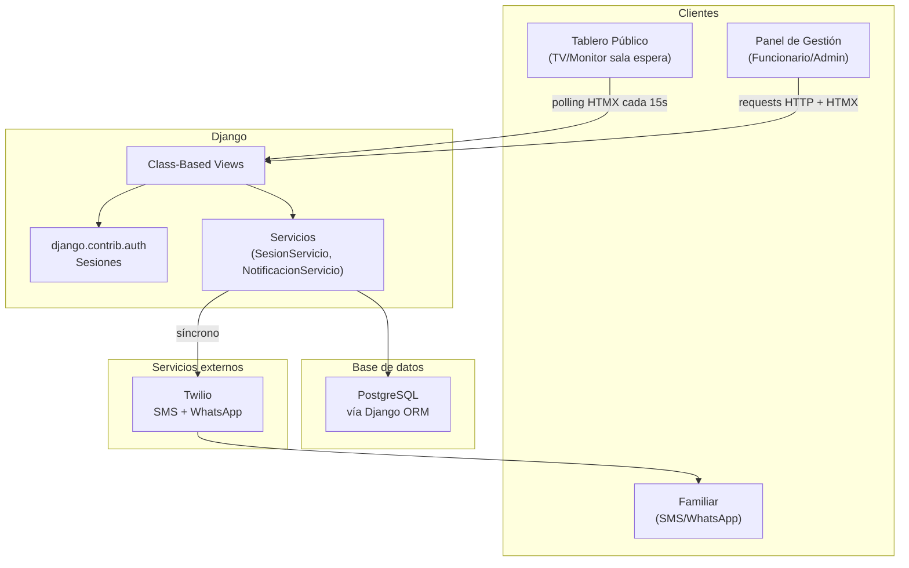

# Documento de Diseño Técnico
## Sistema de Seguimiento de Pacientes Quirúrgicos — MVP

---

## Visión General

Aplicación web en tiempo casi real que permite a los familiares de pacientes quirúrgicos conocer el estado del proceso sin interactuar con el personal médico. Funciona como un tablero tipo aeropuerto proyectado en sala de espera, con actualizaciones automáticas y notificaciones vía SMS/WhatsApp.

**Stack tecnológico (MVP):**
- Backend: Python + Django, vistas basadas en clases (CBV)
- Frontend: Django Templates + HTMX + Tailwind CSS (CDN) + Alpine.js (CDN, solo para modales)
- Tiempo real: Polling con HTMX `hx-trigger="every 15s"`
- Base de datos: PostgreSQL
- Notificaciones: Twilio SDK (síncrono)
- Autenticación: `django.contrib.auth` con `AbstractUser` y sesiones

**Fuera del MVP:**
- WebSockets / Django Channels
- Celery / tareas asíncronas
- DRF / API REST
- Compatibilidad con SQL Server
- Property-Based Testing con Hypothesis
- Bloqueo de cuenta por intentos fallidos (custom)
- Sincronización con base de datos hospitalaria
- Panel de previsualización con divisor arrastrable y scaling

---

## Arquitectura



**Decisiones clave:**

- HTMX polling cada 15s cumple el requisito de actualización en ≤30s sin infraestructura adicional.
- Notificaciones Twilio síncronas: si fallan, se registra en `RegistroNotificacion` sin interrumpir el flujo.
- Unicidad de `codigo_paciente` validada en el servicio (consulta ORM), no con partial index.
- `AbstractUser` de Django sin lógica custom de bloqueo en el MVP.

---

## Estructura del proyecto

```
quiroinfo/                  # proyecto Django
├── app_autenticacion/      # User, login, logout
├── app_pacientes/          # Paciente, formulario de creación
├── app_sesiones/           # SesionActiva, RegistroEstado, lógica de negocio
├── app_notificaciones/     # RegistroNotificacion, NotificacionServicio
└── app_tablero/            # vistas públicas del Tablero
```

---

## Vistas y URLs

| Método | URL | Auth | Descripción |
|--------|-----|------|-------------|
| GET | `/` | No | Redirige a `/tablero/` |
| GET | `/tablero/` | No | Tablero público (template completo) |
| GET | `/tablero/fragmento/` | No | Fragmento HTMX: lista de sesiones visibles |
| GET | `/login/` | No | Formulario de login |
| POST | `/login/` | No | Procesa credenciales |
| POST | `/logout/` | Sí | Cierra sesión |
| GET | `/gestion/` | Sí | Panel de gestión |
| GET | `/gestion/pacientes/crear/` | Sí | Formulario de creación de paciente |
| POST | `/gestion/pacientes/crear/` | Sí | Guarda nuevo paciente |
| POST | `/gestion/sesiones/` | Sí | Activa un paciente (crea sesión activa) |
| POST | `/gestion/sesiones/<id>/estado/` | Sí | Avanza el estado quirúrgico |
| POST | `/gestion/sesiones/<id>/codigo/` | Sí | Modifica el Código_Paciente |
| POST | `/gestion/sesiones/<id>/mensaje/` | Sí | Agrega/edita mensaje libre |
| POST | `/gestion/sesiones/<id>/eliminar/` | Sí | Elimina sesión del tablero |
| GET | `/admin/usuarios/` | Admin | Lista de usuarios |
| POST | `/admin/usuarios/` | Admin | Crea cuenta de Funcionario |
| POST | `/admin/usuarios/<id>/toggle/` | Admin | Activa/desactiva cuenta |

---

## Modelos de Datos

### Enumeraciones

```python
# app_sesiones/models.py
from django.db import models

class EstadoQuirurgico (models.TextChoices):
    EN_PREPARACION  = 'En preparación',   'En preparación'
    EN_CIRUGIA      = 'En cirugía',       'En cirugía'
    EN_RECUPERACION = 'En recuperación',  'En recuperación'
    LISTO           = 'Listo para visita','Listo para visita'
    FINALIZADO      = 'Proceso finalizado','Proceso finalizado'

class RolUsuario (models.TextChoices):
    ADMINISTRADOR = 'Administrador', 'Administrador'
    FUNCIONARIO   = 'Funcionario',   'Funcionario'
```

### `Usuario` (app `app_autenticacion`)

```python
from django.contrib.auth.models import AbstractUser
from django.db import models

class Usuario (AbstractUser):
    Rol = models.CharField (max_length=20, choices=RolUsuario.choices, default=RolUsuario.FUNCIONARIO)

    class Meta:
        db_table = 'usuarios'
```

### `Paciente` (app `app_pacientes`)

Datos personales — nunca expuestos al Tablero.

```python
import uuid
from django.db import models

class Paciente (models.Model):
    Id         = models.UUIDField (primary_key=True, default=uuid.uuid4, editable=False)
    NombreCompleto = models.CharField (max_length=255)
    CreadoEn   = models.DateTimeField (auto_now_add=True)

    class Meta:
        db_table = 'pacientes'
```

### `SesionActiva` (app `app_sesiones`)

Datos del Tablero — sin datos personales.

```python
import uuid
from django.db import models

class SesionActiva (models.Model):
    Id              = models.UUIDField (primary_key=True, default=uuid.uuid4, editable=False)
    Paciente        = models.ForeignKey ('app_pacientes.Paciente', on_delete=models.PROTECT)
    CodigoPaciente  = models.CharField (max_length=50)
    Estado          = models.CharField (
                          max_length=30,
                          choices=EstadoQuirurgico.choices,
                          default=EstadoQuirurgico.EN_PREPARACION
                      )
    Mensaje         = models.CharField (max_length=80, null=True, blank=True)
    TelefonoFamiliar = models.CharField (max_length=20, null=True, blank=True)
    IniciadoEn      = models.DateTimeField (auto_now_add=True)
    ActualizadoEn   = models.DateTimeField (auto_now=True)
    FinalizadoEn    = models.DateTimeField (null=True, blank=True)
    OcultadoEn      = models.DateTimeField (null=True, blank=True)
    CreadoPor       = models.ForeignKey ('app_autenticacion.Usuario', on_delete=models.PROTECT)

    class Meta:
        db_table = 'sesiones_activas'
```

### `RegistroEstado` (app `app_sesiones`)

```python
class RegistroEstado (models.Model):
    Id             = models.UUIDField (primary_key=True, default=uuid.uuid4, editable=False)
    Sesion         = models.ForeignKey (SesionActiva, on_delete=models.PROTECT)
    CodigoPaciente = models.CharField (max_length=50)
    EstadoAnterior = models.CharField (max_length=30, null=True, blank=True)
    EstadoNuevo    = models.CharField (max_length=30)
    CambiadoPor    = models.ForeignKey ('app_autenticacion.Usuario', on_delete=models.PROTECT)
    CambiadoEn     = models.DateTimeField (auto_now_add=True)

    class Meta:
        db_table = 'registro_estados'
```

### `RegistroNotificacion` (app `app_notificaciones`)

```python
class RegistroNotificacion (models.Model):
    CANALES  = [('sms', 'SMS'), ('whatsapp', 'WhatsApp')]
    ESTADOS  = [('enviado', 'Enviado'), ('fallido', 'Fallido')]

    Id             = models.UUIDField (primary_key=True, default=uuid.uuid4, editable=False)
    Sesion         = models.ForeignKey ('app_sesiones.SesionActiva', on_delete=models.PROTECT)
    CodigoPaciente = models.CharField (max_length=50)
    Canal          = models.CharField (max_length=10, choices=CANALES)
    Estado         = models.CharField (max_length=10, choices=ESTADOS)
    MensajeError   = models.TextField (null=True, blank=True)
    EnviadoEn      = models.DateTimeField (auto_now_add=True)

    class Meta:
        db_table = 'registro_notificaciones'
```

---

## Lógica de negocio

### Transición de estados

```python
# app_sesiones/servicios.py
SecuenciaEstados = [
    EstadoQuirurgico.EN_PREPARACION,
    EstadoQuirurgico.EN_CIRUGIA,
    EstadoQuirurgico.EN_RECUPERACION,
    EstadoQuirurgico.LISTO,
    EstadoQuirurgico.FINALIZADO,
]

def SiguienteEstado (Actual: str) -> str | None:
    """Retorna el siguiente estado válido, o None si es el estado final."""
    try:
        Indice = SecuenciaEstados.index (Actual)
        return SecuenciaEstados [Indice + 1] if Indice + 1 < len (SecuenciaEstados) else None
    except ValueError:
        return None
```

### `SesionServicio`

```python
# app_sesiones/servicios.py
from django.utils import timezone

class SesionServicio:

    def ActivarPaciente (self, PacienteId, CodigoPaciente, TelefonoFamiliar, CreadoPor):
        if SesionActiva.objects.filter (Paciente_id=PacienteId, OcultadoEn__isnull=True).exists ():
            raise ValidationError ("El paciente ya tiene una sesión activa.")
        if SesionActiva.objects.filter (CodigoPaciente=CodigoPaciente, OcultadoEn__isnull=True).exists ():
            raise ValidationError (f"El código '{CodigoPaciente}' ya está en uso.")
        return SesionActiva.objects.create (
            Paciente_id=PacienteId,
            CodigoPaciente=CodigoPaciente,
            TelefonoFamiliar=TelefonoFamiliar,
            CreadoPor=CreadoPor,
        )

    def AvanzarEstado (self, Sesion: SesionActiva, CambiadoPor) -> SesionActiva:
        NuevoEstado = SiguienteEstado (Sesion.Estado)
        if NuevoEstado is None:
            raise ValidationError ("El paciente ya se encuentra en el estado final.")
        EstadoAnterior = Sesion.Estado
        Sesion.Estado = NuevoEstado
        if NuevoEstado == EstadoQuirurgico.FINALIZADO:
            Sesion.FinalizadoEn = timezone.now ()
        Sesion.save ()
        RegistroEstado.objects.create (
            Sesion=Sesion,
            CodigoPaciente=Sesion.CodigoPaciente,
            EstadoAnterior=EstadoAnterior,
            EstadoNuevo=NuevoEstado,
            CambiadoPor=CambiadoPor,
        )
        return Sesion
```

### Sesiones visibles en el Tablero

```python
# app_tablero/vistas.py
from django.db.models import Q
from django.utils import timezone
from datetime import timedelta

ColoresEstado = {
    EstadoQuirurgico.EN_PREPARACION:  'bg-yellow-400',
    EstadoQuirurgico.EN_CIRUGIA:      'bg-orange-500',
    EstadoQuirurgico.EN_RECUPERACION: 'bg-blue-500',
    EstadoQuirurgico.LISTO:           'bg-green-500',
    EstadoQuirurgico.FINALIZADO:      'bg-gray-400',
}

def ObtenerSesionesVisibles ():
    """Sesiones visibles en el Tablero. Excluye finalizadas hace más de 60 min."""
    Limite = timezone.now () - timedelta (minutes=60)
    return (
        SesionActiva.objects
        .filter (OcultadoEn__isnull=True)
        .exclude (Q (Estado=EstadoQuirurgico.FINALIZADO) & Q (FinalizadoEn__lt=Limite))
        .only ('Id', 'CodigoPaciente', 'Estado', 'Mensaje', 'ActualizadoEn')
        .order_by ('IniciadoEn')
    )
```

### `NotificacionServicio`

```python
# app_notificaciones/servicios.py
from twilio.rest import Client
from django.conf import settings

class NotificacionServicio:

    def EnviarNotificacion (self, Sesion):
        if not Sesion.TelefonoFamiliar:
            return
        Mensaje = f"Paciente {Sesion.CodigoPaciente}: {Sesion.Estado}"
        self._EnviarPorCanal (Sesion, Mensaje, 'sms')
        self._EnviarPorCanal (Sesion, Mensaje, 'whatsapp')

    def _EnviarPorCanal (self, Sesion, Mensaje, Canal):
        try:
            Cliente = Client (settings.TWILIO_ACCOUNT_SID, settings.TWILIO_AUTH_TOKEN)
            Destino = f"whatsapp:{Sesion.TelefonoFamiliar}" if Canal == 'whatsapp' else Sesion.TelefonoFamiliar
            Cliente.messages.create (body=Mensaje, from_=settings.TWILIO_FROM, to=Destino)
            RegistroNotificacion.objects.create (
                Sesion=Sesion, CodigoPaciente=Sesion.CodigoPaciente,
                Canal=Canal, Estado='enviado'
            )
        except Exception as Error:
            RegistroNotificacion.objects.create (
                Sesion=Sesion, CodigoPaciente=Sesion.CodigoPaciente,
                Canal=Canal, Estado='fallido', MensajeError=str (Error)
            )
```

---

## Tablero Público (`/tablero/`)

- Sin autenticación
- Template completo con layout para TV/monitor (texto mínimo 48px)
- Tailwind CSS: colores de estado, tipografía grande, layout de pantalla completa
- HTMX polling: `hx-get="/tablero/fragmento/"`, `hx-trigger="every 15s"`, `hx-swap="innerHTML"`
- Muestra: `CodigoPaciente`, `Estado` con color, `Mensaje`, `ActualizadoEn`
- Orden: por `IniciadoEn` ascendente
- Si no hay sesiones activas: mensaje simple "No hay pacientes en seguimiento"
- Sin interacción de usuario

---

## Panel de Gestión (`/gestion/`)

- Requiere autenticación (`LoginRequiredMixin`)
- Lista de sesiones activas con código, estado, mensaje y acciones
- HTMX: cambio de estado, edición de mensaje y eliminación sin recargar la página
- Alpine.js: modal de confirmación para acciones destructivas (eliminar sesión)

---

## Manejo de Errores (MVP)

| Escenario | Comportamiento |
|-----------|---------------|
| Transición de estado inválida | HTTP 400; muestra el estado válido disponible |
| Código_Paciente duplicado | HTTP 409; mensaje de conflicto |
| Mensaje > 80 caracteres | HTTP 400; validación en formulario Django |
| Fallo de notificación | Registrado en `RegistroNotificacion`; no interrumpe el flujo |
| Fallo de persistencia al actualizar estado | HTTP 500; conserva estado anterior; notifica al Funcionario |
| Usuario no autenticado en `/gestion/` | Redirección 302 a `/login/` |
| Sesión inactiva > 120 minutos | Django expira la sesión; redirige a login |

---

## Testing Mínimo

### Herramientas
- `pytest-django`
- `factory_boy`
- `unittest.mock` para Twilio

### Tests unitarios
- `SiguienteEstado()`: cada transición válida e inválida
- `SesionServicio.ActivarPaciente()`: unicidad de `CodigoPaciente`
- `SesionServicio.AvanzarEstado()`: secuencia correcta y rechazo de saltos
- Validación de mensaje: límite de 80 caracteres

### Tests de vistas
- `/tablero/` carga sin autenticación y no expone datos personales
- `/gestion/` redirige a login sin sesión activa
- `/tablero/fragmento/` no retorna sesiones ocultas

