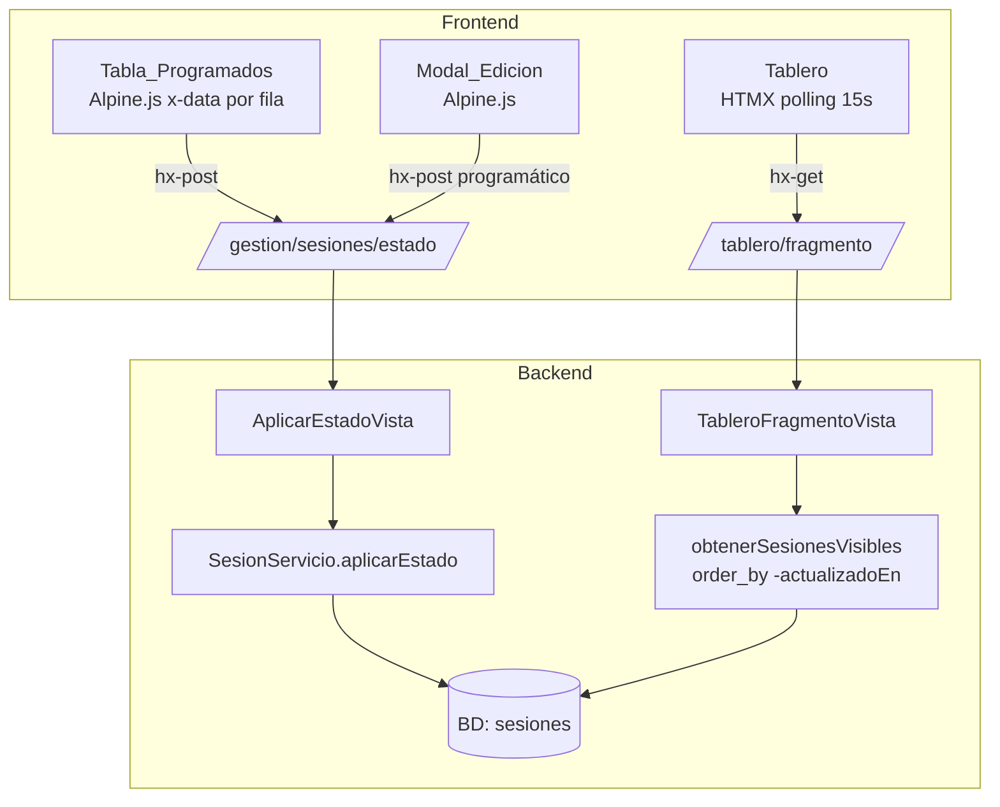

# Documento de Diseño — Mejoras MVP Quiroinfo

## Visión General

Este documento describe el diseño técnico para las cuatro mejoras al MVP de Quiroinfo:

1. Simplificación del Botón_OTRO (eliminación de `descripcionOtro`)
2. Modal de edición de pacientes en el Panel_Gestion
3. Actualización del Tablero: ordenamiento por `actualizadoEn` y layout de tabla
4. Estilo visual oscuro en la Tabla_Pacientes_En_Sala

La arquitectura permanece sin cambios: Django SSR + HTMX + Alpine.js + Tailwind CSS CDN.
No se agregan nuevos endpoints ni modelos. Los cambios son quirúrgicos sobre el código existente.

---

## Arquitectura

La arquitectura existente se mantiene intacta. El diagrama de flujo de datos es:



### Cambios por capa

| Capa | Cambio |
|---|---|
| Modelo (`models.py`) | Eliminar campo `descripcionOtro` de `Sesion` |
| Migración | Nueva migración para eliminar la columna |
| Servicio (`servicios.py`) | Eliminar `descripcionOtro` de `aplicarEstado` y `_validarDescripcion`; cambiar orden en `obtenerSesionesVisibles` |
| Vista (`vistas.py`) | Eliminar lectura de `descripcionOtro` del POST en `AplicarEstadoVista` |
| Template `fragmento_tablas.html` | Simplificar Botón_OTRO, agregar botón Editar, agregar Modal_Edicion, aplicar estilo oscuro a Tabla_En_Sala |
| Template `tablero/fragmento.html` | Reemplazar cards por tabla de filas, mostrar `actualizadoEn` |

---

## Componentes e Interfaces

### 1. Modelo `Sesion` (simplificado)

Se elimina el campo `descripcionOtro`. El modelo queda:

```python
class Sesion (models.Model):
    id            = models.UUIDField (primary_key=True, default=uuid.uuid4, editable=False)
    paciente      = models.ForeignKey (Paciente, on_delete=models.PROTECT)
    estado        = models.CharField (max_length=20, choices=EstadoQuirurgico.choices)
    ingresadoEn   = models.DateTimeField (auto_now_add=True)
    actualizadoEn = models.DateTimeField (auto_now=True)
    oculto        = models.BooleanField (default=False)
```

La migración correspondiente elimina la columna `descripcion_otro` de la tabla `sesiones`.

### 2. `SesionServicio.aplicarEstado`

Firma simplificada — se elimina el parámetro `descripcionOtro` y el método `_validarDescripcion`:

```python
def aplicarEstado (self, paciente: Paciente, nuevoEstado: str) -> Sesion:
    """Crea la sesión si no existe, o actualiza el estado si ya existe."""
```

El estado `OTRO` ya no requiere descripción. Se acepta directamente como cualquier otro estado.

### 3. `obtenerSesionesVisibles`

Cambia el ordenamiento de `-ingresadoEn` a `-actualizadoEn`:

```python
def obtenerSesionesVisibles ():
    """Retorna sesiones activas no ocultas, ordenadas por actualizadoEn descendente."""
    return (
        Sesion.objects
        .filter (oculto=False)
        .select_related ('paciente')
        .only ('id', 'paciente__identificacion', 'estado', 'ingresadoEn', 'actualizadoEn')
        .order_by ('-actualizadoEn')
    )
```

### 4. `AplicarEstadoVista`

Se elimina la lectura de `descripcionOtro` del POST:

```python
def post (self, request):
    pacienteId = request.POST.get ('pacienteId')
    estado     = request.POST.get ('estado')
    # descripcionOtro eliminado
```

### 5. Botón_OTRO en `fragmento_tablas.html`

El Botón_OTRO pasa a comportarse igual que los demás botones: dispara el POST directamente con `hx-post`. El label es dinámico via Alpine.js (`labelOtro`), inicializado en `'Otro'`.

El bloque `x-data` por fila se amplía para incluir el estado del modal y el label:

```js
x-data="{
    estadoActual: '...',
    labelOtro: 'Otro',
    modalAbierto: false,
    editId: '',
    editNombre: '...',
    editEstado: '',
    errorEdicion: ''
}"
```

### 6. Modal_Edicion

Modal Alpine.js dentro de cada fila de la Tabla_Programados. No requiere nuevo endpoint.

Flujo al guardar:
1. Validar que `editId` y `editEstado` no estén vacíos → mostrar `errorEdicion` si fallan.
2. Actualizar `labelOtro` con el valor de `editEstado`.
3. Si el estado fue modificado respecto al estado actual: disparar POST a `aplicar-estado` con `estado=OTRO` usando `htmx.ajax`.
4. Actualizar el texto de identificación en la fila de Tabla_Programados y en Tabla_En_Sala via Alpine.js (manipulación de estado reactivo).
5. Cerrar el modal (`modalAbierto = false`).

La actualización de identificación en Tabla_En_Sala se logra mediante un store Alpine.js compartido o mediante un atributo `x-text` reactivo que lee del estado de la fila correspondiente.

### 7. Template `tablero/fragmento.html`

Reemplaza el grid de cards por una tabla HTML:

```html
<table class="w-full text-sm">
    <thead>
        <tr class="text-left text-gray-500 border-b border-gray-700">
            <th>Identificación</th>
            <th>Estado</th>
            <th>Última actualización</th>
        </tr>
    </thead>
    <tbody>
        
        <tr>
            <td>{{ sesion.paciente.identificacion }}</td>
            <td><span class="badge ...">{{ sesion.get_estado_display }}</span></td>
            <td>{{ sesion.actualizadoEn|date:"d/m/Y H:i" }}</td>
        </tr>
        
    </tbody>
</table>
```

### 8. Tabla_Pacientes_En_Sala en `fragmento_tablas.html`

Aplica estilo oscuro (`bg-gray-900 text-white`) y muestra `actualizadoEn` en lugar de `ingresadoEn`. Los badges de estado usan los mismos colores que el Tablero.

---

## Modelos de Datos

### Sesion (después de la migración)

| Campo | Tipo | Notas |
|---|---|---|
| `id` | UUID PK | auto |
| `paciente` | FK Paciente | PROTECT |
| `estado` | CharField(20) | EstadoQuirurgico choices |
| `ingresadoEn` | DateTimeField | auto_now_add |
| `actualizadoEn` | DateTimeField | auto_now |
| `oculto` | BooleanField | default=False |

El campo `descripcionOtro` se elimina completamente.

### Estado de UI (Label_OTRO)

No persiste en base de datos. Es estado Alpine.js por fila:

```
labelOtro: string  // inicializado en 'Otro', actualizable desde Modal_Edicion
```

---

## Propiedades de Corrección

*Una propiedad es una característica o comportamiento que debe mantenerse verdadero en todas las ejecuciones válidas del sistema — esencialmente, un enunciado formal sobre lo que el sistema debe hacer. Las propiedades sirven como puente entre las especificaciones legibles por humanos y las garantías de corrección verificables por máquina.*

### Propiedad 1: Filtrado de sesiones visibles

*Para cualquier* conjunto de sesiones en la base de datos con mezcla de `oculto=True` y `oculto=False`, `obtenerSesionesVisibles()` debe retornar exactamente y únicamente las sesiones con `oculto=False`.

**Valida: Requisito 3.1**

### Propiedad 2: Ordenamiento por actualizadoEn descendente

*Para cualquier* conjunto de dos o más sesiones visibles (`oculto=False`), el resultado de `obtenerSesionesVisibles()` debe estar ordenado de forma que para todo par de sesiones consecutivas `s_i` y `s_{i+1}` en el resultado, se cumpla `s_i.actualizadoEn >= s_{i+1}.actualizadoEn`.

**Valida: Requisitos 3.2, 4.1**

---

## Manejo de Errores

### Eliminación de `descripcionOtro`

- La migración elimina la columna. Si hay datos existentes en `descripcionOtro`, se pierden (comportamiento esperado según los requisitos).
- El servicio ya no lanza `ValidationError` para el estado `OTRO` por falta de descripción.

### Modal_Edicion — validación frontend

- Si `editId` o `editEstado` están vacíos al guardar: Alpine.js asigna un mensaje a `errorEdicion` y no cierra el modal.
- Si el POST a `aplicar-estado` falla (HTTP 4xx/5xx): HTMX no reemplaza el fragmento. El error queda silencioso en esta iteración (comportamiento heredado del flujo existente).

### Polling del Tablero

- Si el endpoint `/tablero/fragmento/` no responde: HTMX activa el evento `htmx:send-error`, que el template del tablero ya maneja mostrando el banner "Sin conexión" via Alpine.js.

---

## Estrategia de Testing

### Enfoque dual

Se usan tests unitarios para ejemplos concretos y tests basados en propiedades para las propiedades universales identificadas.

**PBT aplica** a la capa de servicio (`obtenerSesionesVisibles`) porque es una función pura con comportamiento que varía significativamente con el input (distintas combinaciones de sesiones ocultas/visibles y distintos valores de `actualizadoEn`). No aplica a los cambios de UI/templates.

### Librería PBT

Se usa **Hypothesis** (ya disponible en el ecosistema Python/pytest del proyecto).

Configuración mínima: 100 iteraciones por propiedad (`@settings(max_examples=100)`).

### Tests unitarios (ejemplos concretos)

Cubren los cambios de comportamiento en el servicio:

- `aplicarEstado(paciente, 'OTRO')` sin `descripcionOtro` no lanza error (Requisito 1.6)
- `aplicarEstado` ya no acepta ni persiste `descripcionOtro` (Requisito 1.1)
- `AplicarEstadoVista` POST con `estado=OTRO` y sin `descripcionOtro` retorna 200 (Requisito 1.2)
- Los tests existentes que dependían de `descripcionOtro` se actualizan o eliminan

### Tests de propiedades (Hypothesis)

**Propiedad 1 — Filtrado de sesiones visibles**

```python
# Feature: quiroinfo-mvp-improvements, Propiedad 1: filtrado oculto=False
@given(st.lists(st.booleans(), min_size=1))
@settings(max_examples=100)
def test_solo_retorna_sesiones_visibles (lista_oculto):
    # Crear sesiones con distintas combinaciones de oculto
    # Verificar que el resultado contiene exactamente las de oculto=False
```

**Propiedad 2 — Ordenamiento por actualizadoEn descendente**

```python
# Feature: quiroinfo-mvp-improvements, Propiedad 2: orden por actualizadoEn desc
@given(st.lists(st.datetimes(), min_size=2))
@settings(max_examples=100)
def test_sesiones_ordenadas_por_actualizado_en_desc (fechas):
    # Crear sesiones con distintos actualizadoEn
    # Verificar que el resultado está ordenado descendentemente
```

### Tests de integración

- Verificar que la migración se aplica sin errores y que la columna `descripcion_otro` ya no existe en la tabla `sesiones`.
- Verificar que el endpoint `/tablero/fragmento/` retorna HTTP 200 con el nuevo layout de tabla.

